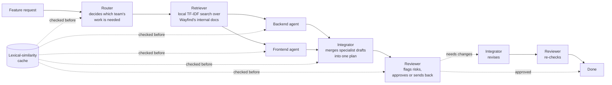

# Relay — an AI SDLC orchestrator (PM case study)

**Live demo:** open `index.html` in any browser — no install, no API key required to try it (defaults to a scripted demo mode if it can't reach the live API).

## The problem

Most "AI SDLC" tools on the market right now (Devin, Cursor, Copilot, and a growing set of multi-agent orchestration platforms) are built *for* engineers, *by* engineers, and they treat "generate more code" as the win condition. But teams adopting these tools are increasingly running into a different problem: integration and QA bottlenecks *between* AI-generated artifacts, not a shortage of generated output.

Relay is a small model of a fix for that: instead of one agent producing an answer and calling it done, it forces every request through a route → ground-in-real-context → draft → integrate → review sequence, with a review checkpoint — and a revision loop back through that checkpoint — before anything is considered finished.

It's built around four specific pieces, because together they cover the parts of an agent system that actually determine whether it's usable and affordable in production:

1. **AI SDLC automation** — turning an unstructured feature request into a scoped, reviewed engineering artifact
2. **Multi-agent coordination** — specialized agents handing off work, including a parallel branch and a feedback loop when review fails
3. **RAG** — grounding agent output in real internal context instead of letting it hallucinate architecture
4. **Caching in agents** — the unglamorous part that actually determines whether an agent system is affordable to run

## What it does

You give it a feature request in plain English (e.g. *"Let drivers export their routes as a CSV"*) for a fictional product, **Wayfind** (a delivery route-planning SaaS with its own small internal doc set). It runs that request through a coordinated pipeline of agents, rendered live as a workflow board:

The Router decides whether a request needs the Backend track, the Frontend track, or both — so single-track tickets (like a UI-only dark-mode request) skip straight past the specialist that isn't relevant, and dual-track tickets run both specialists in parallel. If the Reviewer sends the plan back, the Integrator revises it and the Reviewer checks again — a real feedback loop, not just a straight line.

Every stage before it calls the model checks a shared cache first. Run the same request twice — or two different phrasings of the same request — and the second one skips the model call entirely, and the workflow board shows you the hit live, with the similarity score.

## Design decisions, and what changes in production

This demo takes deliberate shortcuts to stay dependency-free and runnable in a browser with zero setup. Here's what's simplified and what a production version would need instead:

| Decision in this demo | Why, for a demo | What changes in production |
|---|---|---|
| Retrieval uses local TF-IDF cosine similarity, no external embedding API | Zero cost, zero setup, runs instantly in a browser, and is legible — you can see exactly why a doc was retrieved | Real embeddings (e.g. a dedicated embedding model) + a vector database with ANN search, chunking strategy, and freshness/re-indexing policy |
| Cache similarity uses bag-of-words cosine, not true semantic embeddings | Same reason — no external dependency, and it's honest that this is a *lexical* cache, not a semantic one | True semantic caching needs an embedding model behind the similarity check, plus category-aware thresholds and TTLs — static thresholds don't work well across very different query types |
| Cache keys are the raw ticket text (router), ticket+track (specialists), and draft text (integrator/reviewer) | Simple enough to reason about and demo live | Production agent caching is a genuinely unsolved problem at the *task* level, not just the query level — most caching techniques were built for chatbots answering one-off questions, not agents executing multi-step tasks, and agent outputs often depend on live external state that a naive cache can't safely reuse |
| Cost savings shown as an editable assumption ($/1K tokens), not a hardcoded number | Token pricing changes and varies by model/provider — a baked-in number would go stale or mislead | A production dashboard would pull real usage from the API's own `usage` field per call (which this demo already does in Live mode) and apply the actual negotiated/current rate |
| A single Cloudflare Worker proxies every model call | Easiest to demo and keep the API key off the client | A production system would add per-user auth, structured logging/tracing per stage, and provider fallback (e.g. retry on a second provider if the primary is down or rate-limited) |

## What I measured

Every session tracks, live: tickets processed, cache hit rate, model calls avoided, and estimated tokens/cost saved. In a quick test run (paraphrasing the same 4 requests a few different ways), cache hit rate settled around 30–45% depending on the sensitivity slider — which is a deliberately honest, modest number. Real production semantic caching systems report much higher hit rates (some case studies cite 90%+) because they see thousands of real, repetitive user queries; a 4-preset demo can't fairly claim that, and a believable number beats an inflated one.

## What's next

- Real embeddings (rather than TF-IDF/bag-of-words) for both retrieval and caching, with category-aware similarity thresholds instead of one static value
- An evaluation harness so "the agent got it right" is measurable rather than judged by eye — something in the spirit of RAGAS-style retrieval/answer quality metrics
- A genuine conflict-resolution step for cases where the Backend and Frontend drafts disagree on the interface contract, instead of the Integrator silently reconciling them
- Task-level cache keys that account for agents whose output depends on live external state, not just the input text

## Running it

- **Just click through, offline:** open `index.html` in a browser and use **Demo playback** mode — scripted for the 4 presets, template-based for custom text, zero setup.
- **Make it genuinely live:** `index.html` talks to a small Cloudflare Worker (`worker.js`) that holds an API key server-side — a browser can never safely call a model provider directly, so this is the real architecture, not a workaround. Runs on Google's Gemini free tier by default (genuinely free, no expiration). Full deploy steps (15 minutes, no coding) are in `DEPLOY.md`.

## Testing

- `test-cache-logic.mjs` — offline unit checks for the tokenizer and cache-similarity logic (no network, no API usage): `node test-cache-logic.mjs`
- `test-worker-live.mjs` — integration checks against a deployed Worker (uses real API quota): `node test-worker-live.mjs`

## Files in this repo

- `index.html` — the interactive demo
- `worker.js` — the Cloudflare Worker that securely proxies calls to the model provider (this is what makes Live mode real instead of scripted)
- `DEPLOY.md` — step-by-step guide to deploying the Worker and getting a genuinely live public demo
- `test-cache-logic.mjs`, `test-worker-live.mjs` — the test scripts described above
